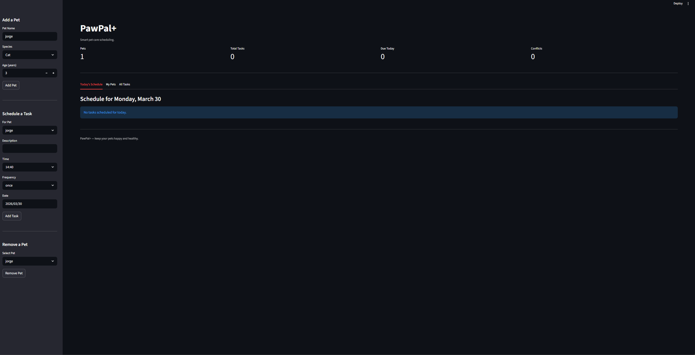

# PawPal+

A smart pet care management system that helps owners keep their pets happy and healthy. Built with Python OOP and Streamlit.

---

## Demo

> 

---

## Features

- **Pet Management** — Add and remove pets with name, species, and age
- **Task Scheduling** — Schedule feedings, walks, medications, and appointments with a specific time and date
- **Sorting by Time** — Tasks are always displayed in chronological order
- **Filtering** — Filter tasks by pet name or completion status
- **Recurring Tasks** — Mark a daily or weekly task complete and the next occurrence is automatically created using timedelta
- **Conflict Detection** — The scheduler warns you when two tasks are booked at the same time on the same day
- **Today's Schedule** — A focused view of only today's tasks, sorted and actionable

---

## Project Structure
```
pawpal/
├── pawpal_system.py        # Core logic: Owner, Pet, Task, Scheduler
├── app.py                  # Streamlit UI
├── main.py                 # CLI demo script
├── tests/
│   └── test_pawpal.py      # Automated pytest suite (16 tests)
├── uml_draft.png           # UML class diagram
├── README.md
└── reflection.md
```

---

## Getting Started

### Install dependencies
```
pip install -r requirements.txt
```

### Run the Streamlit app
```
python -m streamlit run app.py
```

### Run the CLI demo
```
python main.py
```

---

## Smarter Scheduling

PawPal+ implements four algorithmic features in the Scheduler class:

| Feature | Method | Approach |
|---|---|---|
| Chronological sort | `sort_by_time()` | `sorted()` with `lambda t: t.time` on HH:MM strings |
| Status filter | `filter_by_status()` | List comprehension on `task.completed` |
| Pet filter | `filter_by_pet()` | Case-insensitive name match |
| Conflict detection | `detect_conflicts()` | Groups tasks by `(time, date)` tuple, flags groups with more than one task |
| Recurring tasks | `mark_task_complete()` | `timedelta(days=1)` or `timedelta(weeks=1)` added to `due_date` |

---

## Testing PawPal+

Run the full test suite:
```
python -m pytest tests/test_pawpal.py -v
```

The suite covers:

- Task completion and addition
- Daily, weekly, and one-time recurrence logic
- Scheduler integration for recurring tasks
- Sorting correctness
- Filtering by status and pet name
- Conflict detection with and without overlaps
- Owner and pet management including edge cases

**Confidence level: 5/5 — 16/16 tests passing**

---

## Architecture
```
app.py (UI)
    imports
pawpal_system.py (Logic)
    Owner -> holds Pets -> hold Tasks
    Scheduler -> queries Owner, operates on Tasks
```